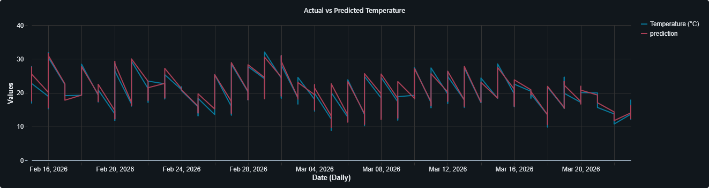

End-to-End Weather Data Pipeline: Databricks & MLlib
📌 Overview

This project demonstrates a complete Data Engineering lifecycle using Databricks. It follows the Medallion Architecture to process real-time weather data from a public API, transform it into structured Delta tables, and utilize Machine Learning to predict future temperatures.
 Architecture

The pipeline is structured into four main stages:

    Ingestion (Bronze): Raw JSON data from the Open-Meteo API persists as a Delta table.

    Transformation (Silver): Data cleaning, schema enforcement, and timestamp casting using PySpark.

    Feature Engineering (Gold): Analytical layer using Spark SQL to create training features (Lags, Time-based variables).

    Machine Learning: Distributed Linear Regression via Spark MLlib to forecast hourly temperatures.

    Serving: Interactive Databricks SQL Dashboard for real-time monitoring and model evaluation.

 Tech Stack

    Platform: Databricks (Community or Enterprise)

    Storage: Delta Lake (Bronze/Silver/Gold)

    Languages: Python (Requests), PySpark, Spark SQL

    ML: Spark MLlib (Linear Regression)

    Orchestration: Databricks Notebooks

 Project Stages
1. Data Ingestion

    Source: Open-Meteo API

    Method: Python requests library to fetch 30 days of historical data.

    Outcome: Raw data stored in the clima_bronze Delta table.

2. Silver Layer (Processing)

    Applied schema transformations to convert string timestamps into TimestampType.

    Dropped unnecessary metadata to optimize storage and compute.

3. Gold Layer & Feature Engineering

    Implemented SQL Window Functions (LAG) to capture temporal trends.

    Extracted hour and day_of_week features to provide the ML model with seasonal context.

4. Machine Learning Pipeline

    VectorAssembler: Grouped features into a single vector column.

    Model: Trained a Linear Regression model with an 80/20 train-test split.

    Persistence: Results (Actual vs. Predicted) are saved into a final clima_predicciones table.

 Results & Visualization

The final output is a Databricks Dashboard that visualizes:

    Historical temperature trends.

    Model accuracy (Actual vs. Predicted temperature).

    Real-time prediction for the next hour.

